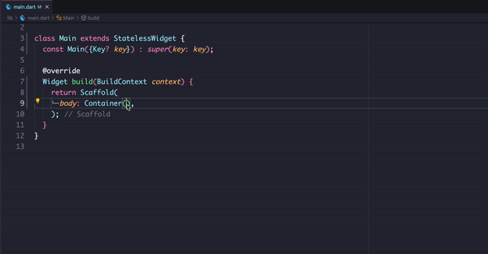

# Flutter Auto insert Comma

Automatically add comma as you create widgets in flutter.

## Usages

Just `Enter` or `CMD(Ctrl) + Enter` in the file.



## Installation

[Flutter Auto Insert Comma](https://marketplace.visualstudio.com/items?itemName=knowbee.flutter-auto-insert-comma)

## Extension Settings

Default value.

```json
{
  "flutter-auto-insert-comma.enableAutoInsertComma": true
}
```

```json
{
  "flutter-auto-insert-comma.activationFiles": [
      "dart",
     ]
}
```

```json
{
  "flutter-auto-insert-comma.disableFiles": []
}
```
## License

MIT

## Author

Igwaneza Bruce
<knowbeeinc@gmail.com>